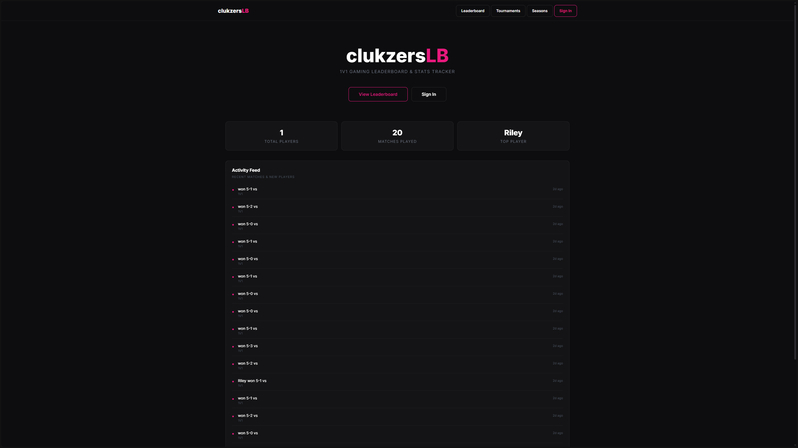

# Rainbow Leaderboard 🏆



A competitive ranking and match-tracking system for **Rainbow Six Siege** — with ELO ratings, seasons, tournaments, and Discord auth. Built for communities that want to run their own ranked ladder.

## Features

- **ELO Rating System** — Glicko-style with provisional ratings, margin-of-victory weighting, and multi-format support (1v1 through 5v5)
- **Rating Decay** — Inactive players lose ELO over time to keep the leaderboard competitive
- **Match Reporting** — Report match results with configurable score formats
- **Tournaments** — Bracket management tied to the rating system
- **Seasons** — Time-based leaderboard resets
- **Discord Auth** — Login with Discord; admin roles for moderation
- **Admin Panel** — Manage players, matches, seasons, and tournaments
- **Rank Icons** — Custom SVG rank icons from Bronze through Champion

## Tech Stack

| Layer | Tech |
|---|---|
| **Backend** | Python 3.12 + FastAPI |
| **Database** | PostgreSQL 16 via asyncpg + SQLAlchemy (async) |
| **Frontend** | Server-rendered with Jinja2 templates |
| **Auth** | Discord OAuth2 |
| **Scheduling** | APScheduler for ELO decay |
| **Container** | Docker + Docker Compose |
| **DB Migrations** | Alembic |

## Quick Start

### Prerequisites

- Docker & Docker Compose

### Setup

1. Clone the repo:
   ```bash
   git clone https://github.com/Martty12212/rainbow-leaderboard.git
   cd rainbow-leaderboard
   ```

2. Build and start:
   ```bash
   docker compose up -d --build
   ```

3. Visit `http://localhost:8000`

### Configuration

Copy and edit the environment file:

```env
DATABASE_URL=postgresql+asyncpg://rainbow:rainbow@db:5432/rainbow
SECRET_KEY=your-secret-key-here
DISCORD_CLIENT_ID=your-discord-client-id
DISCORD_CLIENT_SECRET=your-discord-client-secret
DISCORD_REDIRECT_URI=http://your-domain:8000/auth/callback
```

### Admin Access

Add your Discord user ID to `admin_discord_ids` in `app/config.py` to grant admin privileges.

## API Endpoints

| Method | Path | Description |
|---|---|---|
| GET | `/leaderboard` | View the leaderboard |
| GET | `/players/{id}` | Player profile and stats |
| GET | `/matches` | Match history |
| GET | `/tournaments` | Tournament listings |
| POST | `/api/matches` | Report a match result (admin) |
| POST | `/api/players` | Create a new player (admin) |

Full API routes are defined in `app/routers/`.

## Project Structure

```
rainbow-leaderboard/
├── app/
│   ├── routers/       # API route handlers
│   ├── templates/     # Jinja2 HTML templates
│   ├── static/        # CSS, icons, avatars
│   ├── config.py      # App configuration
│   ├── database.py    # DB connection & session
│   ├── models.py      # SQLAlchemy models
│   ├── schemas.py     # Pydantic schemas
│   ├── elo.py         # ELO rating logic
│   └── ranks.py       # Rank definitions
├── main.py            # FastAPI app entrypoint
├── Dockerfile         # API container build
├── docker-compose.yml # Service orchestration
└── requirements.txt   # Python dependencies
```

## Known Issues 🐛

- **Profile page has rendering bugs** — working on fixes. History display and some UI elements may not render correctly in certain states. Expect a patch soon.

## License

Built for fun. Use it, tweak it, break it.
